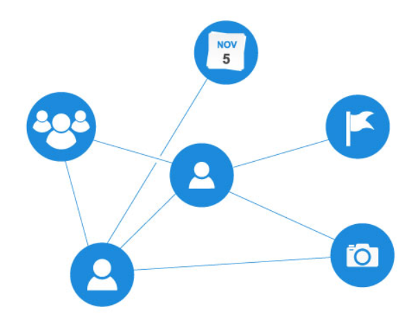

# Graph
- [ ] Done?
## Theory
A graph is a fundamental data structure widely used in many areas of our lives. A graph data structure is a set of nodes that have data and are connected to other nodes.

A graph can be:
- **Undirected**. The edges have no direction, you can freely move in both directions from any graph to any other.
    ```
    1 — 2
     \
      3
    ```
    Here you can go from 1 to 2 and back, and from 1 to 3 and back.
- **Directed**. The edges have directions.
    ```
    1 → 2
     ↘  
       3
    ```
    Here you can go from 1 to 2 and from 1 to 3, but not back.
- **Bidirectional**. This is a special case of a directed graph, in which for every directed edge u -> v, there is a reverse edge v -> u.
    ```
    1 ↔ 2
     ↔  
      3
    ``` 
    ere you can move between all nodes in both directions.
- **One-way**. This is a special case of a directed graph, in which there can only be one direction between two nodes.
    ```    
        A
       ↙ ↘
      B   C
       ↘   ↘
         D → E
    ```
    irections. For example, A - C - E, but not E - C - A.

You can see that **bidirectional** and **undirected** graphs are very similar. This is true, and in fact, the only difference between them is the way the connection between two nodes is stored in memory.
- An undirected graph stores the edge between `A` and `B` as (A, B).
- Bidirectional writes exactly the same edge as two different ones, one for each direction - (A, B), (B, A).

**Let's look at an example**:
On facebook, everything is a node. This includes a user, a photo, an album, an event, a group, a page, a comment, a story, a video, a link, a note... anything that has data is a node.

Each relationship is an edge from one node to another. Whether you post a photo, join a group, or a page, etc. A new edge is created for these relationships.


**Where is it used?**:

- Social Networking: User Interaction;
- Navigation: Finding Routes on Maps;
- Networking Systems: Data Routing;
- Machine Learning: Graph Neural Networks;
- Biology: Gene Interaction Network Analysis;
- Computer Games: Building Path Graphs for AI.

# Explanation

**Methods**:
- addEdge - add an edge to the graph
- removeVertex - remove a vertex from the graph, as well as all edges connected to this vertex.
- removeEdge - remove the edge between vertices `u` and `v`
- printGraph - print the graph as an adjacency list
- hasEdge - check if there is an edge between vertices `u` and `v`
- DFS & startDFS - depth-first traversal
- BFS - breadth-first traversal
___
```cpp
std::unordered_map<int, std::list<int>> adjList;
```
The private field adjList acts as an adjacency list. Here we save the graph as follows:
- the key `std::unordered_map` is a vertex
- the value by this key is a list of adjacent vertices, i.e. neighbors

This implementation option allows you to quickly find neighbors of any vertex.

A graph with vertices 1, 2 and 3, where there are edges (1 → 2), (1 → 3), will be represented as:

```cpp
{
  1: [2, 3],
  2: [],
  3: []
}
```
___
```cpp
// Add new edge
void Graph::addEdge(int u, int v) {
    adjList[u].push_back(v); // Add edge u -> v
    if (!isDirected) {
        adjList[v].push_back(u); // Add a reverse edge v -> u if the graph is undirected
    }
}
```
Find the key `u` and add the value `v` by this key. We get the edge (U, V) Then, if the graph is undirected, we add a link from `v` to `u`. We get (V, U).
___
```cpp
// Remove vertex
void Graph::removeVertex(int vertex) {
    adjList.erase(vertex); // Remove the vertex and all its outgoing connections
    for (auto& pair : adjList) {
        pair.second.remove(vertex); // Remove incoming links to this vertex
    }
}
```
We remove the vertex and all the edges connected to it. In this loop:
```cpp
for (auto& pair : adjList) {
    pair.second.remove(vertex); // Remove incoming links to this vertex
}
```
we look for all keys whose value is `vertex` and remove them.
`pair.first` is the vertex (key). `pair.second` is a list of neighbors (value). `pair.second` is the list of neighbors of `pair.first`. The line `pair.second.remove(vertex)` removes the element vertex from this list.

We iterate over all the vertices in the graph (by keys in `adjList`). For each vertex (key `pair.first`) we check its list of neighbors (value `pair.second`), and if `vertex` is among the neighbors, it will be removed from this list using the `remove()` method.

So this loop removes all references to `vertex` as a neighbor of other vertices. This is important to remove all incoming edges for `vertex`, i.e. edges where `vertex` is a neighbor of other vertices.

### Example:

We have a graph:
```
A -- B -- C
|    |
v    v
D -- E
```
If we call `removeVertex(E)`, then this loop will work as follows in general:

- It will remove all occurrences of E from the neighbor lists of other vertices:
- From the neighbor list of vertex B (since E is a neighbor of vertex B).
- From the neighbor list of vertex C (since E is also a neighbor of C).
___
```cpp
void Graph::removeEdge(int u, int v) {
    adjList[u].remove(v); // Remove edge u -> v
    if(!isDirect) {
        adjList[v].remove(u); // Remove edge v -> u (if graph is undirected)
    }
}
```
Here we simply remove the edge between two vertices. The first line will work in any case, and the second - only if the graph is undirected (or bidirectional).
___
```cpp
// Print graph
void Graph::printGraph() const {
    for (const auto& pair : adjList) {
        std::cout << pair.first << " -> ";
        for (const auto& neighbor : pair.second) {
            std::cout << neighbor << " ";
        }
        std::cout << std::endl;
    }
}
```
Simple graph output as an adjacency list. We iterate over each `pair.second` node, outputting it, and for each we output the neighbor. Between them, `->` is output.
___
```cpp
// Check for existence of edge
bool Graph::hasEdge(int u, int v) const {
    if (adjList.find(u) == adjList.end()) return false;
    for (int neighbor : adjList.at(u)) {
        if (neighbor == v) return true;
    }
    return false;
}
```
First, we check if the vertex `u` exists. If not, we immediately return `false`. If the vertex `u` exists, we start checking all its neighbors. To do this, we use `adjList.at(u)`, which returns a list of all neighbors of the vertex `u` (that is, all vertices with which there are edges from `u`). We iterate over all neighbors stored in the list using a for loop.

In each iteration of the loop, we check if the current neighbor of the vertex `u` is equal to the vertex `v`. If so, then there is an edge between the vertices `u` and `v`, and the method returns `true`, otherwise `false`. ___
```cpp
// Depth First Search (DFS)
void Graph::DFS(int start, std::unordered_map<int, bool>& visited) {
    visited[start] = true;
    std::cout << start << " ";

    for (int neighbor : adjList[start]) {
        if (!visited[neighbor]) {
            DFS(neighbor, visited);
        }
    }
}

void Graph::startDFS(int start) {
    std::unordered_map<int, bool> visited;
    for (const auto& pair : adjList) {
        visited[pair.first] = false; // Initialize visits
    }
    std::cout << "DFS: ";
    DFS(start, visited);
    std::cout << std::endl;
}
```
`DFS` method:
- Depth-first search. `start` is the node to start traversing the graph from, `visited` is a hash table that keeps track of whether nodes have been visited. This is necessary to avoid cycles and infinite recursions when traversing the graph.
    ```cpp
    for (int neighbor : adjList[start]) {
        if (!visited[neighbor]) {
            DFS(neighbor, visited);
        }
    }
    ```
    This is a recursive traversal of neighbors. For each node in the current node's neighbor list (`adjList[start]`), it is checked whether it has already been visited (via the `visited` hash table). If the neighbor has not been visited, the recursive DFS function is called for that neighbor. This results in a repeated traversal of the graph from that node.
    Thus, DFS goes deeper into the graph until it reaches a dead end (or a vertex that has no unvisited neighbors).

`startDFS` method:
- Used to start the `DFS` method. It initializes the traversal process and manages the state of visited vertices.
    ```cpp
    std::unordered_map<int, bool> visited;
    for (const auto& pair : adjList) {
        visited[pair.first] = false; // Initialize visits
    }
    ```
    An empty hash table `visited` is created to keep track of whether a vertex has been visited.
    We traverse all the vertices in the graph (by keys in `adjList`) and initialize them as unvisited (`false`).
    Next we simply call the already discussed `DFS` method, passing it `start` and the newly created `visited` hash table
___
```cpp
// Breadth First Search (BFS)
void Graph::BFS(int start) {
    std::unordered_map<int, bool> visited;
    for (const auto& pair : adjList) {
        visited[pair.first] = false;
    }

    std::list<int> queue;
    visited[start] = true;
    queue.push_back(start);

    std::cout << "BFS: ";
    while (!queue.empty()) {
        int current = queue.front();
        queue.pop_front();
        std::cout << current << " ";

        for (int neighbor : adjList[current]) {
            if (!visited[neighbor]) {
                visited[neighbor] = true;
                queue.push_back(neighbor);
            }
        }
    }
    std::cout << std::endl;
}
```
Breadth-first traversal. There is also a starting node `start` and a hash table `visited`. In these lines:
```cpp
std::list<int> queue;
visited[start] = true;
queue.push_back(start);
```
an empty queue is created, where the starting node `start` is added.

Next, while the queue is not empty, we iterate through this queue with a `while` loop and extract the first node from the queue in each iteration. After that, it is immediately removed from the queue, and then variable storing this vertex is printed in the terminal. In the same cycle, we go through the neighbors and add them to the queue for further processing.

### Step-by-step example of the BFS algorithm

Let's consider the graph:
```
1 — 2 — 3
|    \
4     5
```
Let's start BFS from vertex 1:

- Initialization:

    - Queue: [1]
    - Visited: {1}

- Processing vertex 1:

    - Remove 1 from the queue (queue.pop_front()).
    Add neighbors (2 and 4) to the queue if they have not been visited yet (queue.push_back(neighbor)).

    - Queue: [2, 4]
    - Visited: {1, 2, 4}

- Processing vertex 2:

    - Remove 2 from the queue.
    Adding neighbors (1, 3, 5). 1 is already visited, adding only 3 and 5.
    - Queue: [4, 3, 5]
    - Visited: {1, 2, 3, 4, 5}

- Processing node 4:

    - Remove 4 from the queue.
    - Neighbor 1 is already visited.
    - Queue: [3, 5]

- Processing node 3:

    - Remove 3 from the queue.
    - Neighbors 2 and 5 are already visited.
    - Queue: [5]

- Processing node 5:

    - Remove 5 from the queue.
    - Neighbor 2 is already visited.
    - Queue: []